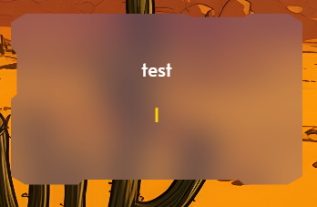
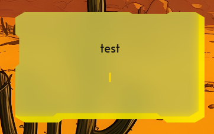
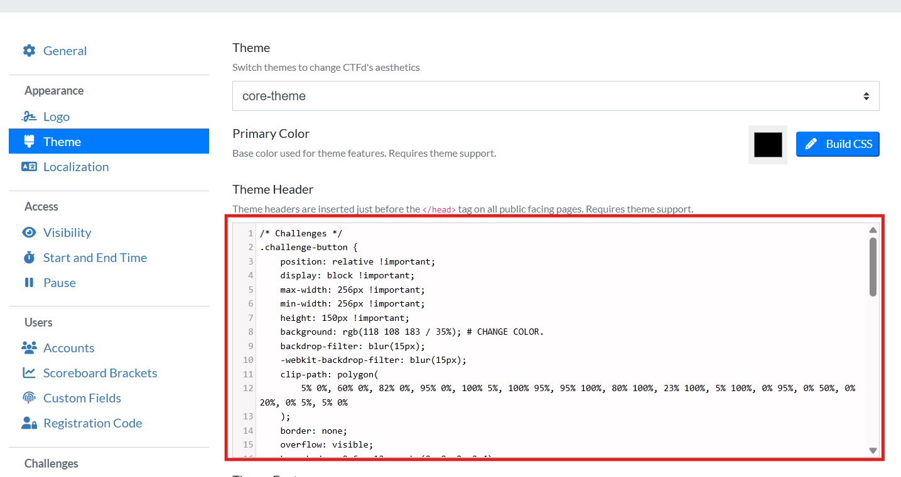

# CTFd – Button Clip-Path Styling

This little snippet gives your CTFd buttons that angular, cyber-panel look you often see in game HUDs and sci-fi terminals. It relies on CSS `clip-path`, which lets you carve shapes out of elements like you're sculpting with a laser cutter.

<table>
  <tr>
    <td align="center">
      
    </td>
    <td align="center">
      
    </td>
  </tr>
</table>
		

## Example clip-path

```css
clip-path: polygon(
    5% 0%, 60% 0%, 82% 0%, 95% 0%, 100% 5%,
    100% 95%, 95% 100%, 80% 100%, 23% 100%,
    5% 100%, 0% 95%, 0% 50%, 0% 20%, 0% 5%, 5% 0%
);
```

This polygon traces the outline of the shape. Tweaking percentages lets you reshape the panel edges however you like.

## Craft your own shapes

If you want to experiment, this visual tool helps you sculpt polygons without guesswork:

[https://unused-css.com/tools/clip-path-generator](https://unused-css.com/tools/clip-path-generator)

## How to apply it in CTFd

1. Open **Settings → Theme** in your CTFd admin panel.
2. Find **Theme Header**.
3. Paste the contents of **[style.css](style.css)** there and save.

Your buttons should update instantly with those clean geometric cuts.

---



---

